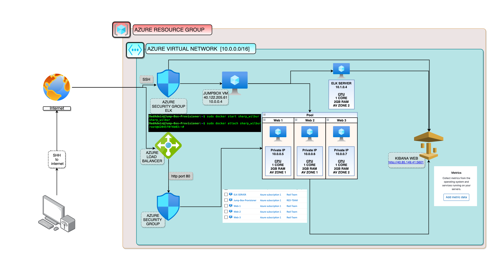
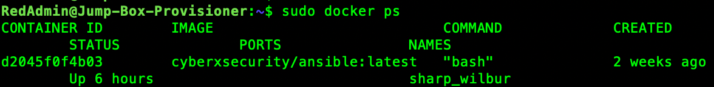
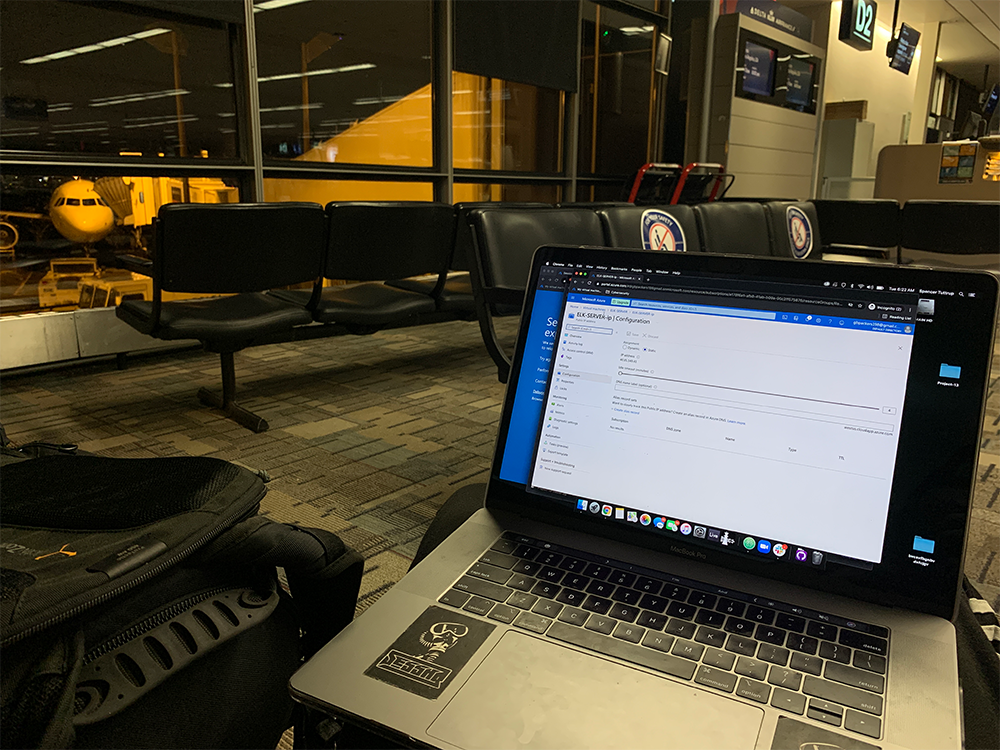

# Project-13
Automated ELK Stack Deployment - Azure
# Spencer Tuttrup
## Automated ELK Stack Deployment

The files in this repository were used to configure the network depicted below. The diagram lays out the process of the ELK configuration.

These files have been tested and used to generate a live ELK deployment on Azure. They can be used to either recreate the entire deployment pictured above. Alternatively, select portions of the .yml file may be used to install only certain pieces of it, such as Filebeat. Below is an image on how the playbook files should layout in your terminal.

  - [Playbooks Layout in Terminal](Ansible/allyml.png)

This document contains the following details:
- Description of the Topologu
- Access Policies
- ELK Configuration
  - Beats in Use
  - Machines Being Monitored
- How to Use the Ansible Build

### Description of the Topology

The main purpose of this network is to expose a load-balanced and monitored instance of DVWA, the D*mn Vulnerable Web Application.

Load balancing ensures that the application will be highly stable, in addition to restricting traffic to the network.

  - What aspect of security do load balancers protect?
      - Load balancers help defend against (DDos) attacks by having multiple paths and backups of the same servers. An advantage of using load balancers is the ability to remove unhealthy or broken servers from the pool until they are restored.

  - What is the advantage of a jump box?
      - The Jump Box allows all administrators and users to access devices in a separate security zone. This allows us to control the access between devices.

Integrating an ELK server allows users to easily monitor the vulnerable VMs for changes to the log and system files.
  - What does Filebeat watch for?
      - Filebeat watches for log files and or separate locations you specify. 
  - What does Metricbeat record?
      - Metricbeat takes the recorded items such as metrics and stats and sends them to the specified output.

The configuration details of each machine may be found below:

| Name        | Function | IP Address | Operating System |
|-------------|----------|------------|------------------|
| Jump Box    | Gateway  | 10.0.0.4   | Linux            |
| Web-1       | Client   | 10.0.0.5   | Linux            |
| Web-2       | Client   | 10.0.0.6   | Linux            |
| Web-3       | Client   | 10.0.0.7   | Linux            |
| ELK-SERVER  | Gateway  | 10.1.0.4   | Linux            |

[Network Interfaces Azure](Images/Network_Interfaces.png)

### Access Policies

The machines on the internal network are not exposed to the public Internet.

Only the Jump-Box machine can accept connections from the Internet. Access to this machine is only allowed from the following IP addresses:
- `40.122.205.61`

Machines within the network can only be accessed by SSH from the terminal. There is no pretty "GUI" such as windows.
  - Which machine has access your ELK VM? What was its IP address?
      - The Jump-box machine is the only machine with access to the ELK VM. The individual ip of this machine is 10.2.0.4.

A summary of the access policies in place can be found in the table below.

| Name       | Publicly Accessible | Allowed IP Addresses |
|------------|---------------------|----------------------|
| Jump Box   | Yes                 | 40.122.205.61        |
| Web 1      | No                  | 10.0.0.1-254         |
| Web 2      | No                  | 10.0.0.1-254         |
| Web 3      | No                  | 10.0.0.1-254         |
| Elk Server | No                  | 10.1.0.0-254         |

### Elk Configuration

Ansible was used to automate configuration of the ELK machine. No configuration was performed manually, which is advantageous because...
  - Automation in Ansible allows IT administrators the ability to eliminate the redundancy in daily tasks.

The playbook implements the following tasks:
- Step 1 : Install Docker
- Step 2 : Install Pip [a python based installer]
- Step 3 : Install Docker Modules
- Step 4 : Increases virtual memory [can be done manually but this ensures there is space]
- Step 5 : Downloads and installs ELK container
- Step 6 : Enables Docker on boot to eliminate issues with connection to Kibana

A few quick commands to run to gain access and test your container starting from scratch in the terminal [MAC] We are assuming the user RedAdmin.
- 1 : ssh RedAdmin@40.122.205.61 - for where I have [40.122.205.61] you are to replace with your instance IP.
- 2 : sudo docker container list -a - this checks the containers. Note you only want 1 container.
- 3 : sudo docker start sharp_wilbur - this starts the container. Your container WILL have a different name.
- 4 : sudo docker attach sharp_wilbur - Attaches started container.

   - :white_check_mark: *Welcome to Root@ random_numbers_here* :white_check_mark:

The following screenshot displays the result of running `docker ps` after successfully configuring the ELK instance.

---

### Target Machines & Beats
This ELK server is configured to monitor the following machines:
- Web-1: 10.0.0.5
- Web-2: 10.0.0.6
- Web-3: 10.0.0.7
- ELK-SERVER: 10.1.0.4

   - Note: Upon opening these for the first time, make sure you run sudo RedAdmin@10.0.0.5 [5,6,7] or [10.1.0.4] to ensure connection. Say "YES" for allow.

<dl>
  <dt>We have installed the following Beats on these machines:</dt>
  <dd>FileBeat & Metricbeat</dd>
  <dt>These Beats allow us to collect the following information from each machine:</dt>
  <dd>FileBeat monitors the VM's systems and logs data such as when the files have changed around while Metricbeat collects metrics from the systems and various services</dd>
</dl>

### Using the Playbook
In order to use the playbook, you will need to have an Ansible control node already configured. Assuming you have such a control node provisioned:

SSH into the control node and follow the steps below:
- 1. Copy the playbook file to etc/ansible.
- 2. Update the hosts file to include the appropriate IP address.
- 3. Run the playbook, and navigate to 10.0.0.5 [5 or 6 or 7] to check that the installation worked as expected.

<dl>
  <dt>Q:  Which file is the playbook? Where do you copy it? </dt>
  <dd>Ansible-playbook.yml is the playbook and can be found @ /etc/ansible. It is not found here: [Wrong Playbooks](Linux/wrong_playbooks.mp3) </dd>
  <dt>Q:  Which file do you update to make Ansible run the playbook on a specific machine? How do I specify which machine to install the ELK server on versus which to install Filebeat on? </dt>
  <dd>The specified machine checks the hosts file and the individual IP. This can be specified by choosing the correct machine which would be the ELK-Server with an IP of 10.2.0.4 and Nano'ing into the Ansible playbook. </dd>
  <dt>Q:  Which URL do you navigate to in order to check that the ELK server is running?</dt>
  <dd>http://40.85.149.41:5601 - This IP should be the same one from the table of "JUMP BOX" From above.</dd>
</dl>

---

### What if I don't live at a permanent IP and travel around frequently? 

Have no fear, the containers and IP's are easy to change around and can be done with your machines already configured. Over the past week I have changed locations, states and even countries and still have successful Ansible/Azure access. 

Here are the steps to EASILY change around your IP.
- 1: In your Azure, navigate to the home page and make sure your machines are started.
- 2: Navigate to "Network Security Groups" 
- 3: On the right hand side of those groups, you should see your previously configured IP's containing the ones to your old network.
- 4: Figure out the new IP of the location you are at. I use ipchicken.com. There is a screenshot below of my IP. Just kidding it's [Public hotel wifi I am at] go ahead hack me away.
- 5: Click on the name of the Inbound Security rule that has the old IP. [:grinning:](Images/localip.png)

